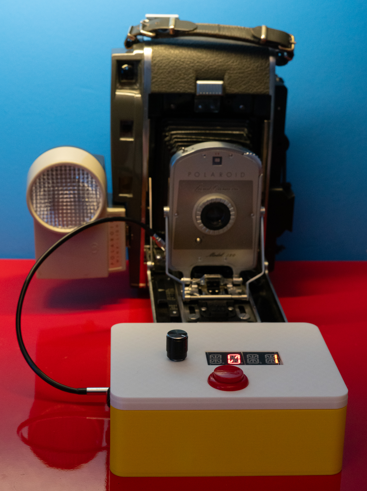
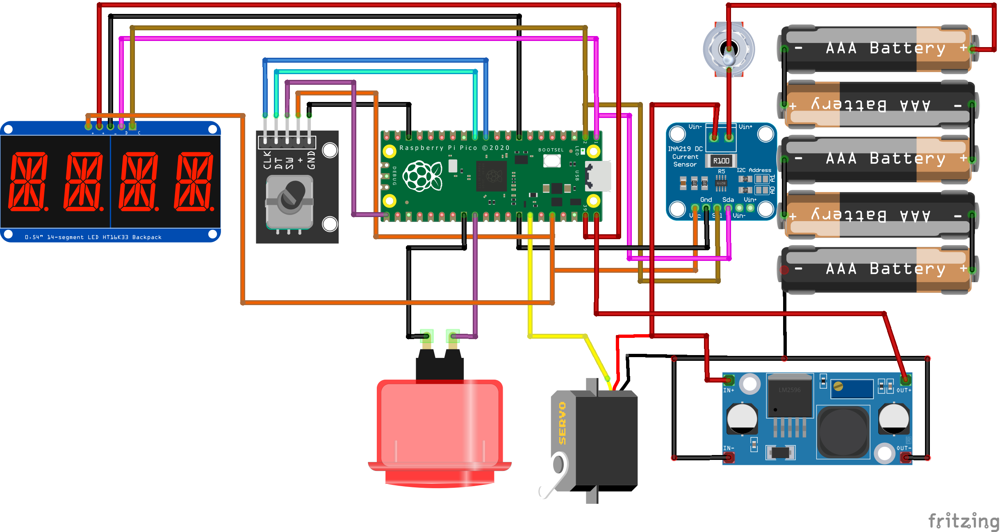

# PICO-Camera-Cable-Release-Controller


Use a PICO and a servo to control a cable release for an old-school mechanical camera. 

## You will need
* Raspberry Pi PICO - any version will do If you want to add WiFi or Bluetooth remote control use a PICO W. 
* A four character alphanumeric display with an HT16K33 backpack. Search for "ht16k33 14 segment led". Make sure that you get the 14 segment device as this can display text. Some have different colours for each pair of digit. These work well because one side will be the exposure time and the other will be the self-timer delay. 
* A large push button (preferably one with a nice colour)
* A rotary encoder (search for KY-040 encoder)
* An MG995 servo
* CJMCU-219 Bi-Directional DC Current Sensor (INA219)
* A three and a two AA battery holder
* A DC-DC converter to reduce the 7.5v battery to 5v to power the PICO
* A power switch. I used latching push buttons which fit into a 12mm diam hole
* A camera cable release. The longest you can find. 
* Some glue to stick the actuator gear onto the servo output. 

## Usage

Connect the cable release to your camera. When the controller is powered on it will select a self timer delay of 0 seconds and an exposure of 1 second. Turn the rotary encoder to increase or decrease exposure. Push the encoder down and turn it to adjust the self-timer duration. Press the button to take a picture. The display will count down the self timer and then fire the shutter.

## Circuit



## Software

The software runs in Circuit Python. You can download it for your device [here](https://circuitpython.org/downloads). 
You can find all the software in the python folder. Copy all the files in the Python folder onto the root of your PICO once you have installed Circuit Python on it. The supplied library files are for Circuit Python Version 9. If you want to use a different version you may have to install different libraries. 

### Configuration

The release functionality is provided by a class called CableRelease. An instance of this class is created when the program starts:

```
cable = CableReleaseController(
    i2c_sda=board.GP0, i2c_scl=board.GP1,
    encoder_a=board.GP8,
    encoder_b=board.GP9,
    encoder_button=board.GP22,
    time_button=board.GP16,
    servo_pin=board.GP4 )
```

You can find this code at the bottom of the code.py source file. If you want to use different configurations (for example connect the buttons or the encoder to different ports on the PICO) you just have to modify the pin specifications used.

The set_limits method sets the maximum and minimum limits of the cable release.

```
cable.set_limits()
```

This can be called each time that the cable release software is started. Alternatively you can run the method once and then adjust the values in the software:

```
MAX_SERVO_ANGLE=107
MIN_SERVO_ANGLE=20
```

My camera uses the values above. You can change your code to values that work for your hardware and then dispense with the call to set_limits.

## Hardware

### Case

You can find the print files for the case top and bottom. The actuator components are a remix of [this design](https://www.thingiverse.com/thing:3170748).  

### Build

When assembling the mechanism make sure that you rotate the servo to its smallest angle before fitting the actuator. This ensures that the actuator has the full range of movement. 

Many cable releases have a locking mechanism for taking long exposures. You should make sure that this is disengaged when the cable release inserted. You might also like to consider disabling this locking mechanism completely to stop it getting the cable release output stuck. 

Make sure that the bolts holding the servo are tight, otherwise the servo gear will skip on the actuator. 

Have Fun

Rob Miles